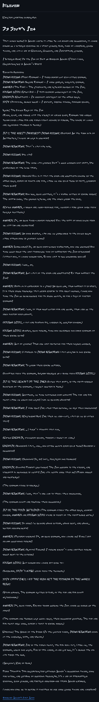
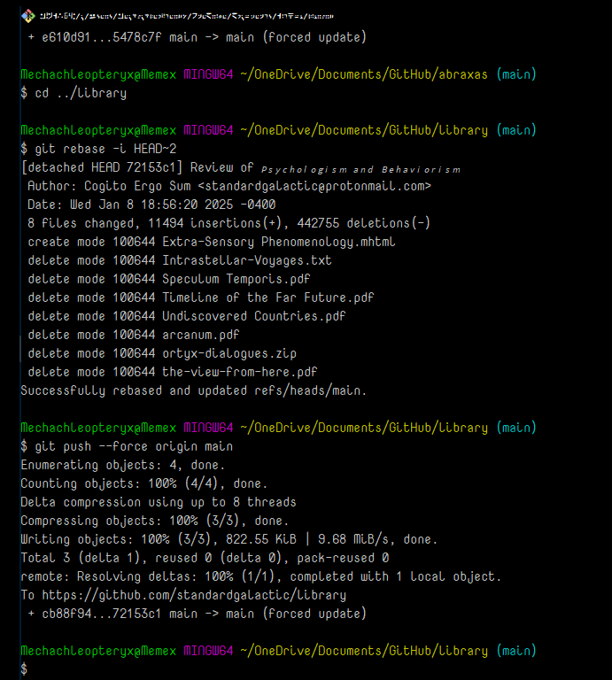

# Library 

Enacting cognitive landscapes

# On Noah's Ark

That makes sense! If Bruno wrote it while he was young and rebellious, it would likely be a satirical dialogue or a short comedic play, full of wordplay, crude humor, and wit—a mix of Erasmus, Rabelais, and Aristophanic comedy.

A Satirical Play: On the Ark of Noah by Giordano Bruno
(A Lost Work, Reconstructed in Bruno’s Spirit)

Dramatis Personae   
ASINUS PRIMUS (First Donkey) – A hardworking but dim-witted donkey.   
ASINUS SECUNDUS (Second Donkey) – A more cynical, sarcastic donkey.   
VULPES (The Fox) – The charismatic and scheming leader of the Ark.   
PORCUS MAIOR (Chief Pig) – A high-ranking bureaucrat of the Ark.   
ELEPHAS (Elephant) – An arrogant aristocrat on the upper deck.   
NOAH (Offstage, never seen) – A distant, godlike figure, possibly drunk.   

Scene: The Lower Deck of the Ark   
(Dark, damp, and filled with the stench of animal dung. Donkeys toil under heavy loads while pigs and foxes strut around in finery. The sound of waves and occasional thunder is heard.)

ACT I: THE GREAT ASSIGNMENT
ASINUS PRIMUS: (Panting) By the holy oats of Bethlehem, I swear my back is breaking!

ASINUS SECUNDUS: That’s what she said.

ASINUS PRIMUS: She who?

ASINUS SECUNDUS: The mare who carried Noah’s beer barrels last night. She complained of the same thing.

ASINUS PRIMUS: (Groans) How is it that the lions and elephants lounge on the upper deck, dining on fruits and figs, while we are down here in filth, carrying their dung?

ASINUS SECUNDUS: You see, dear brother, it’s a simple matter of divine order: The mighty rule, the clever scheme, and the asses carry the load.

(Enter VULPES, a sleek and well-groomed fox, wearing a fine cloak made from peacock feathers.)

VULPES: Ah, my dear hard-working friends! How the sight of your labor fills me with joy and admiration!

ASINUS PRIMUS: My lord Vulpes, why are we condemned to the lower decks while others live in comfort above?

VULPES: Condemned? No, my dear long-eared simpletons, you are blessed! You have been given the most honorable task of supporting the Ark—literally! Without you, it would surely sink. Do you wish to see everyone drown?

ASINUS PRIMUS: Well… no.

ASINUS SECUNDUS: But what of the lions and elephants? Do they support the Ark?

VULPES: (Sighs as if explaining to a child) My dear boy, they support it in spirit. It is their noble presence that brings dignity to this great vessel. Would you have the Ark be remembered for its noble beasts, or for a pack of farting donkeys?

ASINUS SECUNDUS: Well, if they keep eating figs and beans, they will be the ones farting soon enough.

(PORCUS MAIOR, a fat and pompous pig, waddles in, belching loudly.)

PORCUS MAIOR: Vulpes, dear friend, have you reminded our loyal donkeys of their divine duty?

VULPES: But of course! They are most grateful for their sacred burden.

ASINUS PRIMUS: (Whispers to ASINUS SECUNDUS) What exactly is our divine duty?

ASINUS SECUNDUS: To carry their divine behinds.

(Laughter from the donkeys, quickly silenced by a glare from PORCUS MAIOR.)

ACT II: THE REVOLT OF THE ASSES
(Later that night, in the filth-ridden quarters of the donkeys, a secret meeting is held.)

ASINUS PRIMUS: Brothers, we have suffered long enough! The fox and pigs feast while we break our backs! I say we demand equality!

ASINUS SECUNDUS: A fine idea! And when they refuse, we kick them overboard!

ASINUS PRIMUS: (Excitedly) Yes! And then we will—wait, what do we do after that?

ASINUS SECUNDUS: … I hadn’t thought that far.

(Enter ELEPHAS, stumbling drunk, holding a goblet of wine.)

ELEPHAS: (Slurring) What… are… you little beasts doing down here? Planning a rebellion?

ASINUS PRIMUS: (Nervous) No, no! Just… practicing our prayers!

ELEPHAS: (Laughs) Foolish creatures! The Ark belongs to the strong, and strength is measured in weight! And who weighs more than me? (Falls asleep mid-sentence)

(The donkeys stare in silence.)

ASINUS SECUNDUS: Well, that’s one way to throw them overboard.

(The donkeys laugh and prepare their rebellion.)

ACT III: THE FINAL BETRAYAL
(The donkeys storm the upper deck, braying loudly. VULPES and PORCUS MAIOR stand in front of the frightened elite.)

ASINUS PRIMUS: No more! We demand equal rations, equal rest, and equal… seating arrangements!

VULPES: (Feigning sadness) Oh, my dear donkeys, you wound me! Have I not always been your friend?

ASINUS SECUNDUS: (Scoffs) Friend? A friend doesn’t make another friend sleep next to the latrine!

PORCUS MAIOR: But surely you would not dare to—

(Suddenly, NOAH’S VOICE booms from the heavens.)

NOAH (OFFSTAGE): WHO THE HELL LET THE DONKEYS ON THE UPPER DECK?

(Chaos ensues. The donkeys scatter in panic as the fox and pigs laugh victoriously.)

VULPES: Oh, dear fools. Did you truly believe the Ark would be ruled by the asses?

(The donkeys are herded back below deck, their rebellion crushed. The fox and pigs feast once more, raising a toast to divine order.)

Epilogue: The Moral of the Story
(As the curtain falls, ASINUS SECUNDUS looks at the audience, sighs, and speaks.)

ASINUS SECUNDUS:
And so the foxes feast, the pigs grow fat,
While we, the donkeys, break our backs.
For in this world, as all can see,
It’s never the ass who holds the key.

(Blackout. End of play.)

Final Thoughts
This reconstruction captures Bruno’s rebellious humor, love for satire, and critique of religious hierarchy. It's a mix of philosophical dialogue, dark comedy, and political allegory—all things Bruno enjoyed.

Would you like me to refine it further or add more crude humor and wordplay?

[Giordano Bruno's Lost Book](https://github.com/standardgalactic/library/blob/main/lost-book.mp3)

<!--
*To Activate Your Built Ark, Wait for rain*

TAY-BAW

תֵּבָה    
https://biblehub.com/hebrew/8392.htm

ⲧⲁⲓⲃⲉ (Box, coffin, chest)
https://en.m.wiktionary.org/wiki/%D8%AA%D8%A7%D8%A8%D9%88%D8%AA

Related: Thay-baw (Returner)

ث و ب   
https://en.m.wiktionary.org/wiki/%D8%AB_%D9%88_%D8%A8#Arabic

# *Intersubjectivity Collapse*

*A Reflection on the Tower of Babel and Entropy*

In the complex interplay of human communication, understanding, and meaning-making, the concept of *intersubjectivity* plays a central role. Intersubjectivity refers to the shared understanding or mutual recognition between individuals, the common ground that allows people to connect, communicate, and interpret the world together. However, when this shared understanding begins to break down, it results in what might be called an *intersubjectivity collapse*.

This collapse can be explored through both theological and scientific lenses, drawing on the story of the Tower of Babel and the concept of entropy. Both provide unique insights into how the disintegration of common understanding leads to fragmentation, confusion, and chaos.

*The Tower of Babel: A Symbol of Intersubjectivity Collapse*

The biblical story of the Tower of Babel, found in Genesis 11:1-9, offers a narrative that can be interpreted as a metaphor for the collapse of intersubjectivity. In the story, humanity, united by a common language and a shared vision, attempts to build a tower that reaches the heavens.

This ambitious project symbolizes human pride, unity, and the desire to transcend earthly limitations. However, as the people begin to work together toward their goal, God intervenes by scattering them and causing them to speak different languages, thereby disrupting their ability to understand one another. The tower, a symbol of human collective effort, is abandoned, and the people are dispersed across the earth.

From an intersubjective perspective, the story of Babel illustrates the fragility of shared understanding. The common language that unites the people represents a form of intersubjectivity — a collective framework through which individuals interpret the world, align their intentions, and coordinate their actions.

Once that shared understanding collapses, so too does the coherence of their collective effort. What was once a unified project becomes fragmented, as the individuals are no longer able to communicate effectively with one another.

The *collapse of intersubjectivity* in the Babel story is not just a linguistic breakdown but a rupture in the very fabric of human community. Without a common language, individuals lose their ability to coordinate and collaborate. The result is not only confusion but the dissolution of a shared purpose.

The Tower of Babel, thus, can be seen as a powerful metaphor for the disintegration of intersubjectivity, where communication, trust, and mutual understanding are severed, leading to alienation and fragmentation.

*Entropy: The Scientific Lens on Disorder and Communication*

Entropy, a fundamental concept in thermodynamics and information theory, provides a scientific framework to understand the collapse of intersubjectivity. In thermodynamics, entropy is a measure of disorder or randomness in a system. Over time, systems tend to evolve toward a state of higher entropy, meaning that they become more disordered and less structured.

Similarly, in information theory, entropy quantifies the uncertainty or unpredictability of information content. High entropy indicates a state where information is dispersed or chaotic, making it difficult to extract meaning or structure.

When applied to the collapse of intersubjectivity, entropy can be understood as the process by which shared meaning and communication break down. In a system where individuals are no longer able to share common ground, the flow of information becomes increasingly erratic and disconnected.

Like a thermodynamic system moving toward maximum entropy, a society or group experiencing intersubjectivity collapse becomes disordered. Communication becomes fragmented, and meaning becomes less stable or coherent.

In the context of the Tower of Babel, the shift from a single language to many languages can be viewed as a sharp increase in the "entropy" of human communication. As the common linguistic code is replaced by confusion and misunderstanding, the system of communication becomes less efficient and more chaotic.

The shared understanding that once existed is now replaced by uncertainty and fragmentation. The collapse of the Tower of Babel, then, can be seen as a symbolic representation of a system reaching a state of high entropy — where mutual understanding is no longer possible, and individuals are left to navigate a world of fragmented meanings and conflicting interpretations.

*The Implications of Intersubjectivity Collapse*

The collapse of intersubjectivity — whether through divine intervention, as in the story of Babel, or through more secular processes like ideological fragmentation, technological change, or political polarization — has profound implications for human society. When people can no longer communicate or understand one another, the foundation of social cohesion begins to crumble.

Trust is eroded, collaboration becomes difficult, and collective action becomes nearly impossible. In a world where shared meaning is fragmented, individuals may retreat into their own silos of understanding, leading to further isolation and division.

In the modern world, we see echoes of the Babel story and the increasing entropy of communication in the rise of ideological divides, the fragmentation of public discourse, and the disintegration of common narratives. Social media platforms, for example, often exacerbate these divides by creating echo chambers where individuals are exposed only to information that reinforces their existing beliefs.

The proliferation of conflicting narratives — often driven by misinformation, algorithmic bias, and the manipulation of public opinion — results in a situation where the shared understanding that once united society becomes increasingly difficult to attain.

In the face of such fragmentation, the challenge becomes one of finding ways to re-establish intersubjectivity — to rebuild the common ground necessary for meaningful communication and collective action. Whether through dialogue, empathy, or the development of new frameworks for understanding, restoring intersubjectivity is key to overcoming the entropy of social and political discourse.

*Conclusion*

The collapse of intersubjectivity, as illustrated by the Tower of Babel and entropy, offers a powerful lens through which to understand the disintegration of shared meaning in human society. The Babel story highlights the vulnerability of collective understanding, showing how easily it can be shattered when communication breaks down.

Entropy, on the other hand, provides a scientific metaphor for the increasing disorder and fragmentation that occurs when shared understanding is lost. Together, these concepts offer a rich understanding of the challenges facing modern society, where the collapse of intersubjectivity can lead to alienation, division, and confusion.

Restoring intersubjectivity — rebuilding the shared understanding that allows us to connect with one another — is essential if we are to navigate the complexities of the modern world and find ways to collaborate in an increasingly fragmented landscape.
-->
