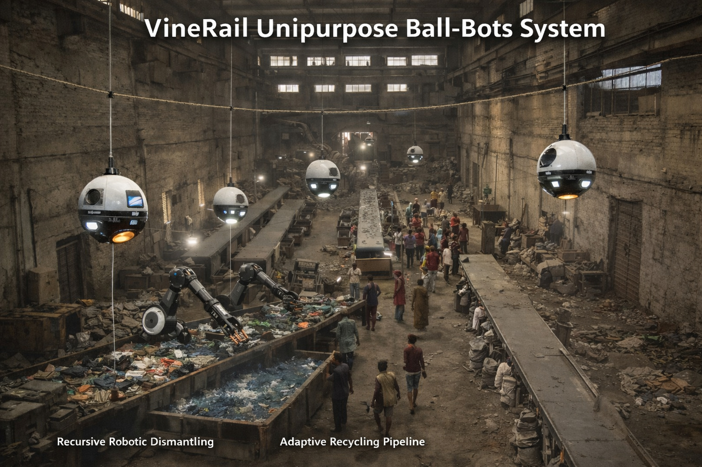

# Identity, Trust, and Structural Coherence

This repository collects a set of closely related research essays examining identity, trust, and meaning as architectural properties of large-scale systems. The documents develop a unified theory in which identity functions as infrastructure, metrics obey thermodynamic constraints, and trust emerges only under enforced structural coherence.

Together, these texts explore why digital platforms, metric systems, and optimization-driven institutions tend to fail—and what kinds of constraints are required to prevent collapse.

## Documents

Markdown

- **[Identity as Namespace](Identity_as_Namespace.md)**  
  The core formal briefing. Argues that identity must function as a unique, persistent namespace binding actions to histories. Introduces attributional entropy, Goodhart collapse, phase transitions, hysteresis, and the principle of *Constraint Before Optimization*, framed through the RSVP field model.

- **[Identity Coherence](Identity_Coherence.md)**  
  A focused exploration of identity coherence as an informational invariant. Develops the idea of coherence as a conserved quantity necessary for reputation, causality, and accountability across time.

- **[The Unseen Law](The_Unseen_Law.md)**  
  A high-level, accessible essay describing the inevitable decay of social platforms when identity constraints are weak. Presents the theory as a universal structural law governing trust erosion and metric collapse.

- **[The Physics of Trust](The_Physics_of_Trust.md)**  
  A more formal and technical treatment modeling trust as a field phenomenon. Uses thermodynamic analogies, phase transitions, and RSVP dynamics to explain why trust loss is abrupt, nonlinear, and difficult to reverse.

Pdf

- **[VineRail Unipurpose Ball-Bots](https://standardgalactic.github.io/library/processing/VineRail%20Unipurpose%20Ball-Bots.pdf)**  
  This document presents the core architectural concept of the VineRail system: a biomimetic warehouse automation framework based on ceiling-brachiated, spherical robots constrained to single-purpose task identities. It develops the mechanical design, locomotion strategy, relay-based task decomposition, and recursive sorting–dismantling paradigm that together enable continuous processing of heterogeneous materials. Emphasis is placed on environment-as-mechanism design, safety-through-constraint, and the replacement of general-purpose manipulation with infrastructure-mediated specialization. The document functions as the conceptual and systems-level foundation for VineRail.

- **[VineRail Facility Control Specification](https://standardgalactic.github.io/library/processing/VineRail%20Facility%20Control%20Specification.pdf)**  
  This document formalizes the VineRail architecture as an industrial control system, specifying the complete facility pipeline using UML/SysML-style models, PLC hierarchies, safety zoning, and deterministic state machines. It translates the conceptual VineRail framework into implementable automation artifacts, including controller decomposition, safety interlock topology, vendor-neutral PLC function blocks, and detailed pipeline logic for recursive sorting, dismantling, washing, and centrifuge-based separation. The specification serves as a bridge between conceptual design and certifiable industrial deployment, enabling direct realization within standard PLC ecosystems.

## How These Fit Together

These documents should be read as a layered system:

- *The Unseen Law* provides intuition and motivation.
- *The Physics of Trust* supplies a formal dynamic model.
- *Identity Coherence* isolates the key invariant.
- *Identity as Namespace* integrates the full theory into a unified architectural framework.

All texts are research drafts and part of an evolving theoretical program. They are intended to clarify first principles before proposing technical implementations, policy mechanisms, or normative objectives.
