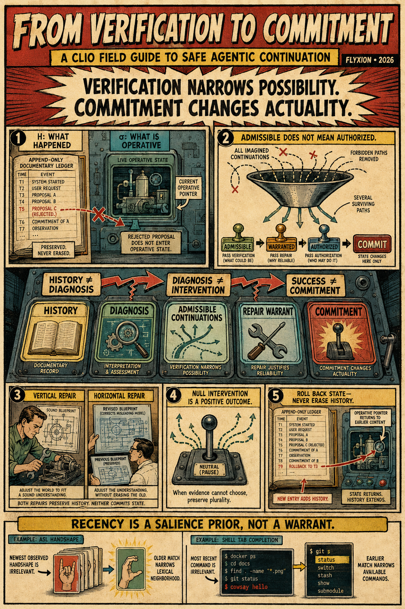

# Library | Workspace

[From Verification to Commitment](https://standardgalactic.github.io/library/workspace/from-verification-to-commitment.pdf)

[The Cost of Knowing](https://standardgalactic.github.io/library/workspace/cost-of-knowing.pdf)

[Admissibility Before Truth](https://standardgalactic.github.io/library/workspace/admissibility-before-truth.pdf)

[Observability is Restorability](https://standardgalactic.github.io/library/workspace/observability-is-restorability.pdf)

[Erasure is Deformation](https://standardgalactic.github.io/library/workspace/erasure-is-deformation.pdf)

[Geometry of Witnesses](https://standardgalactic.github.io/library/workspace/geometry-of-witnesses.pdf)

[Conservation of Ambiguity](https://standardgalactic.github.io/library/workspace/conservation-of-ambiguity.pdf) — *Incomplete*
